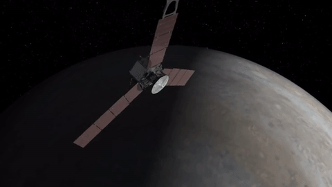

<p align="center"></p>

<h1 align="center">API Missações realizadas no planeta jupiter</h1>

<h3 align="center">
API REST de código aberto para dados de consulta de  pesquisa  as informações nela contida  foi desenvolvida usando como base nos dados da <a href="https://www.nasa.gov/subject/6893/nebulae/" target="_blank">NASA</a>
 <a href="https://chandra.harvard.edu/photo/2007/orion/"usando como base organizacional um sistema de CRUD
<p align="center">
 
<a href="https://www.travis-ci.com/github/Mario23junior/Api-Nebulosas/pull_requests" target="_blank">
<a href="https://en.wikipedia.org/wiki/Representational_state_transfer"></a>
</p>

## Etapas para testar ou reproduzir

## Primeiro execute o maven 
 
```
 mvn package
```
## Em seguida faça
```
java -jar target/missaojupiter-API-1.0-SNAPSHOT.jar

```
 
## Uso

```
localhost:8080/project/mission/jupiter/api/v1/
```

## Resultado dos dados da API

```json
 [
   {
      "id":4,
      "nome":"Galileo",
      "descricao":"Galileo foi uma nave espacial norte-americana não tripulada, lançada pela NASA para estudar o planeta Júpiter, suas luas e outros corpos celestes do Sistema Solar. Batizada em homenagem ao astrônomo italiano Galileo Galilei",
      "indentificacao":"1989-084B",
      "duracaoDaMiscao":"13 anos, 11 meses e 3 dias",
      "missaosDto":[
         {
            "id":6,
            "dataDeLacamento":"18/10/1989",
            "destino":"Júpiter",
            "dataDeAterrissagem":"07/12/1995",
            "veiculoDeLancamento":"ônibus espacial Atlantis",
            "galileoDto":null
         }
      ],
      "propriedadesDtos":[
         {
            "id":5,
            "fabricante":"Jet Propulsion Laboratory  Messerschmitt-Bölkow-Blohm , General Electric , Hughes Aircraft Company",
            "orbitador":" nave espacial orbital reutilizável do programa do ônibus espacial da NASA, a agência espacial dos Estados Unidos.",
            "aterrissador":"06°05′N 04°04′W",
            "geradorDeEnergia":"Orbitador: GTR , Aterrissador: Bateria",
            "massaDeCargaUtil":"Orbitador: 118 kg , Aterrissador: 30 kg"
         }
      ],
      "junoDto":[
         {
            "id":1,
            "nome":"Juno",
            "descricao":"Juno é uma sonda espacial da NASA atualmente orbitando o planeta Júpiter.",
            "tipo":"sonda",
            "duracao":6
         }
      ],
      "pinnerDtos":[
         {
            "id":2,
            "nome":"pioneer",
            "descricao":"O Programa Pioneer foi um programa espacial desenvolvido pelos Estados Unidos para permitir o envio de missões não tripuladas ao espaço, projetadas para a exploração planetária.",
            "dataDeConstrucao":"22/03/1971",
            "objetivo":"pesquisa da orbitador lunar",
            "tripulada":false
         }
      ],
      "voyagerDtos":[
         {
            "id":3,
            "nome":"Voyager",
            "destino":"Júpiter ,Saturno, respectivas luas, Urano, Netuno",
            "dataLancamento":"13/02/1977",
            "tipo":"Programa espacial",
            "tripulada":false,
            "galileoDto":null
         }
      ]
   }
]

```
